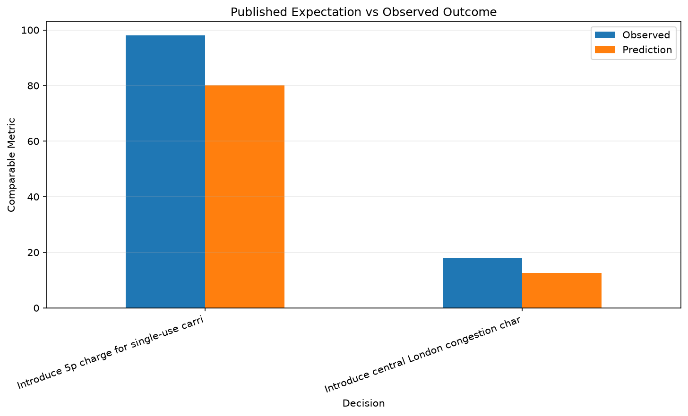
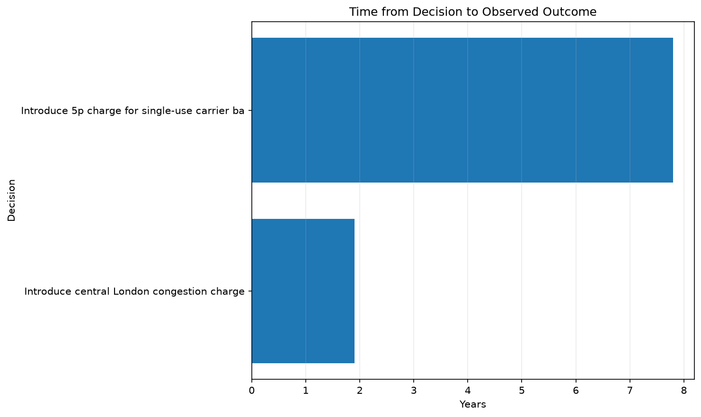
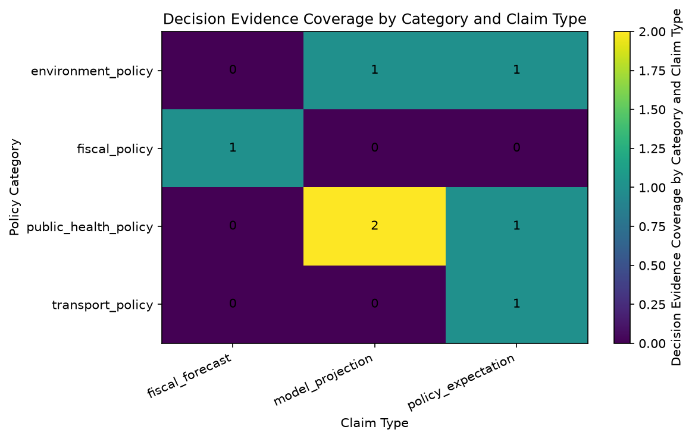

# Debated Decisions vs Outcomes

Comparing claims made during major policy debates with measurable outcomes observed afterward

## Summary

- Decisions analyzed: 7
- Categories: 4
- Jurisdictions: 4

## Published Expectations vs Outcomes

## Decision-to-Outcome Horizon

## Evidence Coverage Matrix

This matrix shows where the current decision dataset has
coverage across policy categories and types of claims.

## Decisions vs Outcomes

| Category | Decision | Decision Date | Outcome Date | Horizon | Claim at the Time | Observed Outcome | Confidence |
|---|---|---|---|---|---|---|---|
| transport_policy | Introduce central London congestion charge | 2003-02-17 | 2004-12-31 | 1.9 years | The scheme was predicted to reduce traffic entering central London by 10 to 15 percent. | 18.00 percent | high |
| environment_policy | Introduce 5p charge for single-use carrier bags | 2015-10-05 | 2023-07-31 | 7.8 years | Government said the charge could reduce usage by as much as 80 percent in large supermarkets. | 98.00 percent | high |
| public_health_policy | Introduce minimum unit pricing for alcohol | 2018-05-01 | 2021-12-31 | 3.7 years | Modelling projected approximately a 3.5 percent reduction in alcohol consumption after introduction of minimum unit pricing. | 3.50 percent reduction | high |
| public_health_policy | Introduce minimum unit pricing for alcohol | 2018-05-01 | 2020-12-31 | 2.7 years | Pre-implementation modelling projected a reduction in alcohol-attributable deaths after minimum unit pricing. | 13.40 percent reduction | high |
| public_health_policy | Introduce the Soft Drinks Industry Levy | 2016-03-16 | 2020-12-31 | 4.8 years | The levy was designed to encourage manufacturers to reformulate drinks and reduce sugar content. | 46.00 percent reduction | high |
| fiscal_policy | Introduce the Soft Drinks Industry Levy | 2016-03-16 | 2019-03-31 | 3.0 years | Budget 2016 expected the Soft Drinks Industry Levy to raise about £520 million in its first full year. | 240.00 GBP million | medium |
| environment_policy | Expand ULEZ across all London boroughs | 2023-08-29 | 2024-08-29 | 1.0 years | Expansion was expected to reduce road-transport emissions and improve roadside air quality across outer London. | 4.80 percent reduction | high |

## Interpretation Principle

Observed outcomes are reported separately from causal attribution.

A change occurring after a policy decision does not, by itself,
prove that the policy caused the entire observed effect.

---
Generated by Analytics Platform
