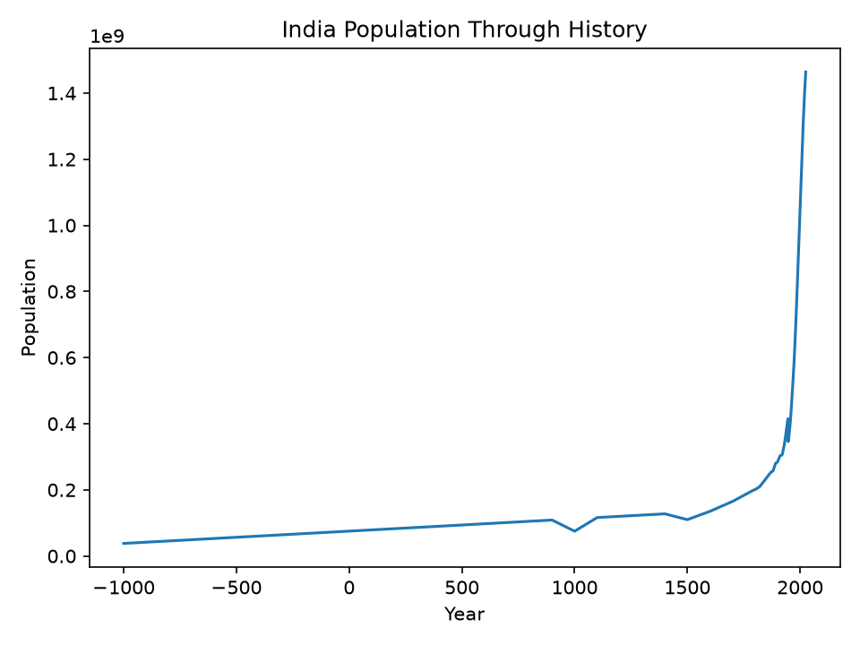

# Global Economic History

Long-run economic and population history

## India Population Through History

## Historical Milestones

| Year | Population | GDP | GDP per Capita |
|---|---|---|---|
| -1,000 | 38,052,184 | N/A | N/A |
| 1 | 75,000,000 | N/A | N/A |
| 1,000 | 75,000,000 | N/A | N/A |
| 1,500 | 110,000,000 | N/A | N/A |
| 1,700 | 165,000,000 | 191,730,000,000 | 1,162.00 |
| 1,800 | 200,733,034 | N/A | N/A |
| 1,900 | 284,500,000 | 271,697,500,000 | 955.00 |
| 1,950 | 359,000,000 | 354,333,000,000 | 987.00 |
| 1,960 | 435,990,338 | 520,800,000,000 | 1,200.00 |
| 2,000 | 1,057,922,733 | 3,184,793,405,807 | 3,010.42 |
| 2,020 | 1,402,617,695 | 10,080,423,278,587 | 7,186.86 |
| 2,025 | 1,463,865,525 | 14,695,849,780,452 | 10,039.07 |

## Data Coverage

- Earliest year: -1000
- Latest year: 2025
- Observations: 792
- Duplicate years: 0

---
Generated by Analytics Platform