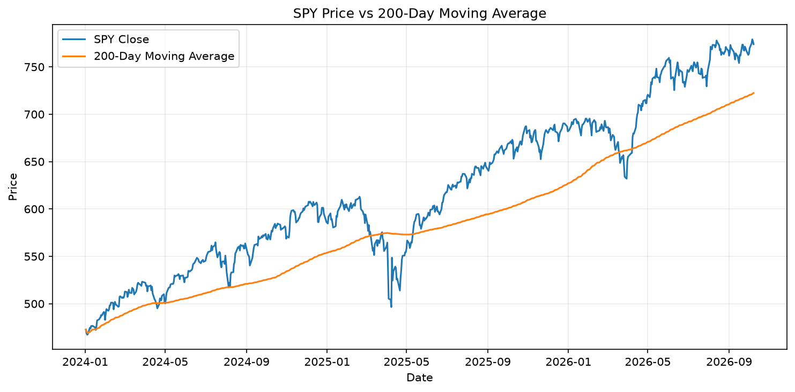
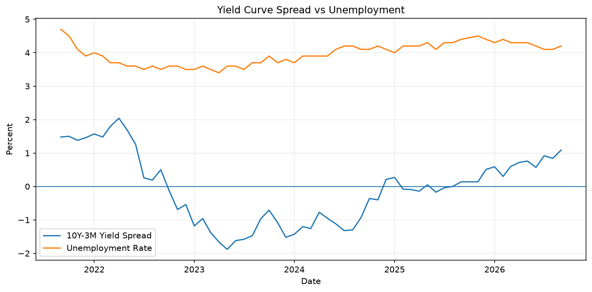

# Market Risk Monitor

Market and macro risk snapshot

## Market Snapshot

| Metric | Value |
|---|---:|
| SPY Close | 773.93 |
| 200-Day Moving Average | 722.46 |
| 30-Day Volatility | 9.94% |
| Drawdown | -0.66% |
| 10Y-3M Yield Spread | 0.99% |
| Unemployment Rate | 4.20% |

## Market Trend

## Macro Risk Signals

## Data Dates

- Market data: 2026-10-08
- Yield data: 2026-10-08
- Unemployment data: 2026-09-01

---
Generated by Analytics Platform
